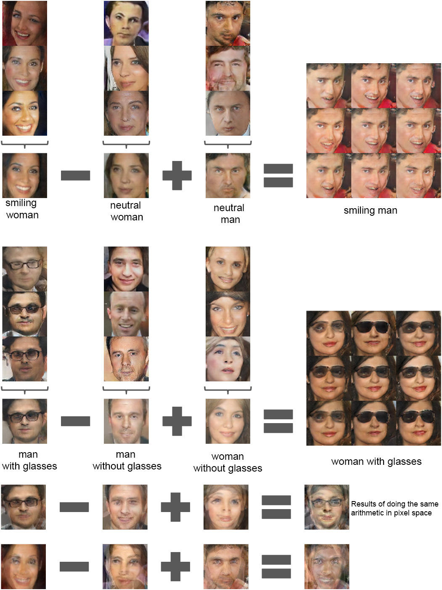

## 参考：画像のベクトル演算

* ディープラーニングを使った画像のベクトル演算の例
 * 「笑っている女性」-「女性」+「男性」=「笑っている男性」
 * 「サングラスをかけた男性」-「男性」+「女性」=「サングラスをかけた女性」

> Unsupervised Representation Learning with Deep Convolutional Generative Adversarial Networks
>
> https://arxiv.org/pdf/1511.06434

> はじめてのGAN
>
> https://elix-tech.github.io/ja/2017/02/06/gan.html

> CVPR2016 reading - 特徴量学習とクロスモーダル転移について
>
> http://www.slideshare.net/akisatokimura/cvpr2016-reading

> ディープラーニングの発展と最新動向
>
> https://www.slideshare.net/nlab_utokyo/20160601-62645719

> ディープラーニングの基礎技術と今後の課題・展望　～画像認識分野を中心に～
>
> https://www.slideshare.net/nlab_utokyo/20150930-53741757
