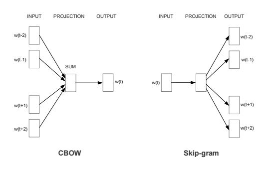

## Word2Vecの仕組み

### 学習アルゴリズム

* CBoW(Continuous Bag-of-Words)
 * 周囲の単語から中心の単語を予測する

* Skip-Gram
 * 中心の単語から周囲の単語を予測する

> Efficient Estimation of Word Representations in
Vector Space
>
> https://arxiv.org/pdf/1301.3781v3.pdf
