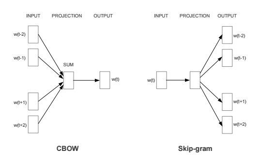

## Word2Vecの仕組み

### 入力データ

* 単語は空白文字で区切る
* 文章は改行で区切る

### ハッシュテーブルによる文章の表現

| 辞書  | 単語ハッシュ値 |
| ----- |:--------------:|
| a     | 1              |
| is    | 2              |
| pen   | 3              |
| this  | 4              |

| 文章 |      |      |      |
|:----:|:----:|:----:|:----:|
| this | is   | a    | pen  |
| 4    | 2    | 1    | 3    |

### 1-of-K表現による単語ベクトルの管理

| 単語ハッシュ値 | 単語ベクトルデータ |
| -------------- |:------------------:|
| this           | (1, 0, 0, 0)       |
| is             | (0, 1, 0, 0)       |
| a              | (0, 0, 1, 0)       |
| pen            | (0, 0, 0, 1)       |

* ある要素だけが1で、それ以外が0なベクトル
* 100万語の単語ベクトルを管理する場合、1つの単語は100万次元のベクトルで表現される。

### BoW(Bag-of-Words)

　「文章」をその中に含まれている単語の1-of-Kベクトルを足し合わせたもので表現する方法

| 辞書  | 単語ハッシュ値 |
| ----- |:--------------:|
| a     | 1              |
| an    | 2              |
| apple | 3              |
| my    | 4              |
| is    | 5              |
| pen   | 6              |
| this  | 7              |

| 文章             | 単語ベクトルデータ     |
| ---------------- |:----------------------:|
| this is a pen    | (1, 0, 0, 0, 1, 1, 1 ) |
|                  |                        | ） 距離 1.4    |
| this is my pen   | (0, 0, 0, 1, 1, 1, 1 ) |
|                  |                        | ） 距離 2.0    |
| this is an apple | (0, 1, 1, 0, 1, 0, 1 ) |

### 学習アルゴリズム

> Efficient Estimation of Word Representations in
Vector Space
> https://arxiv.org/pdf/1301.3781v3.pdf

* CBoW(Continuous Bag-of-Words)
 * 周囲の単語から中心の単語を予測する

* Skip-Gram
 * 中心の単語から周囲の単語を予測する

### 高速化の手法

* Negative Sampling
 * window変数（デフォルト：5単語） の範囲内にある単語については関連性の確率を高く、それ以外からランダムに選ばれた単語については確率を低くするように学習していく手法

* 階層的ソフトマックス
 * 全ての単語毎に計算した場合、膨大な計算量になるため、階層的なグループに分けて、各グループごとに学習する

> word2vecのソースを読んでみた
>
> http://qiita.com/mash0510/items/347964f3eb2e080ea7a4
