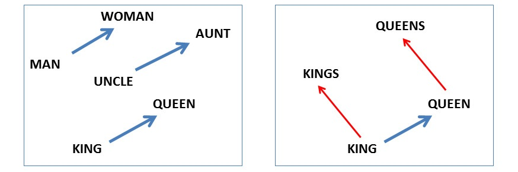

## Word2Vecとは

　日本人が日常的に使う語彙数は数万から数十万と言われます。Word2Vecでは各単語を200次元（200個の数字の組み）の空間内におけるベクトルとして表現します。単語をベクトル化することで、

* 単語同士の類似度の評価
* 単語間の演算

をすることができます。

* 'king'（王様） - 'man'（男） + 'woman'（女）= 'queen'（女王）
 * 「王様から男を引いて女を足したものは何か？」
 * 「男→王様」の関係を女に適用したものは何か？」

> Linguistic Regularities in Continuous Space Word Representations
>
> http://msr-waypoint.com/en-us/um/people/gzweig/Pubs/NAACL2013Regularities.pdf

* 'Paris'（パリ） - 'France'（フランス） + 'Italy'（イタリア）= 'Rome'（ローマ）
 * 「フランスにとってのパリはイタリアにとっての何か？」

> Distributed Representations of Words and Phrases
and their Compositionality
>
> http://papers.nips.cc/paper/5021-distributed-representations-of-words-and-phrases-and-their-compositionality.pdf
